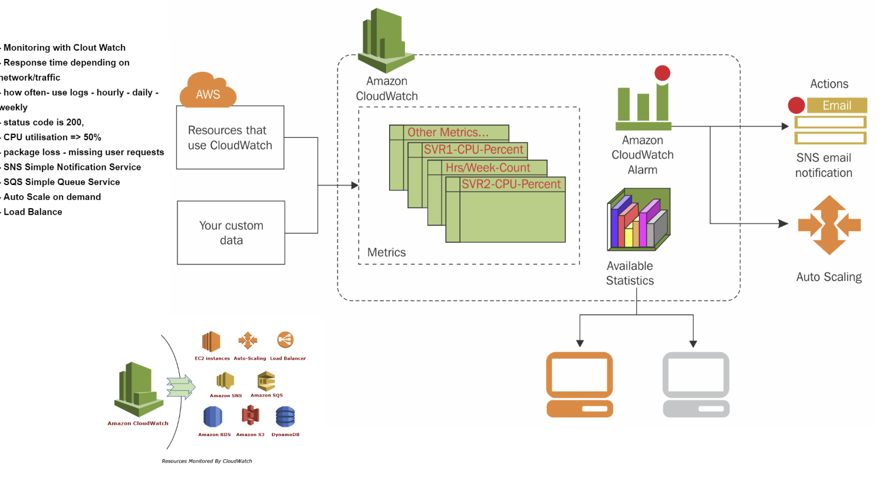

## Amazon Web Services
### EC2
* Create an EC2 instance -VM
* Ubuntu 18.04LTS
* Determine the size of VM
* Establish a security group
* SSH into the machine 
* `cd ~/.ssh` copy and past SSH compands from aws counsel/client connect
* cd into app folder
* Update and Upgrade `sudo apt-get update -y` `sudo apt-get upgrade -y`
* Install NGINX `sudo apt-get install nginx -y`
  * Will be available publicly
* npm start
* Require a public ip for the EC2 Instance
* transfer the app via securecp `scp` or rsync
install dependencies

### UsingSynce:
rsync -avzh -e "ssh -i eng99.pem" /Vagrant/starter-code/app/ ubuntu@ec2-34-245-24-17.eu-west  
-1.compute.amazonaws.com:/home/ubuntu/app
* scp -i pem_file file_to_copy user@ip:/destination
example: `scp -i "~/.ssh/eng99.pem" restaurant.py ubuntu@e***.com:/home/ubuntu/new_folder/restaurant.py`
# cloud_computing_sparta
## What is cloud computing 
Cloud computing is the on-demand availability of computer system resources, especially data storage and computing power, without direct active management by the user. Large clouds often have functions distributed over multiple locations, each location being a data center.

## What are the benefits?
* Reduced IT costs. Moving to cloud computing may reduce the cost of managing and maintaining your IT systems. ...
* Scalability. ...
* Business continuity. ...
* Collaboration efficiency. ...
* Flexibility of work practices. ...
* Access to automatic updates. ...

## Who is using it in IT tech
* Organizations of every type, size and industry use the cloud for varying use cases such as data backup, disaster recovery, email, virtual desktops, software development and testing, big data analytics, and customer-facing web applications.

* E.g. Healthcare companies are using the cloud to develop more personalized treatments for patients. Financial services companies are using the cloud to power real time fraud detection and prevention. And video game makeers are using the cloud to deliver online games to millions of players around the world.

* Sooner or later every organisaion start adapting could services.

## Types of Cloud Computing

### Infrastructure as a Service (IaaS) 
Contains the basic building blocks for cloud IT. Provides access to networking features, computers and data storage space. IaaS delivers the highest level of flxibility and management control over your IT resources.

### Platform as a Service (PaaS) 
Removes the need for you to manage underlying infrastructure (hardware and OS), and allows you to focus on the deployment and management of your applications. This helps you be more efficient as you dont need to worry about resource procurement, capacity planning, software maintenance, patching or any of the other undifferentiated heavy lifting involved in running your application.

### Software as a Service (SaaS) 
Provides you with a complete product that is run and managed by the service provider. You dont have to think about how the service is maintained or how the underlying infrastructure is managed. You only need to think about how you will use that particular software.

## What is AWS? 
Amazon Web Service is the world's most comprehensive and broadly adopted cloud platform, offering over 200 fully featured services from data centers globally. Millions of customers - including the fastest growing startups, largest enterprises and leading government agencies are using AWS to lower costs, become more agile and innovate faster.

## Benefits of AWS
Most Functionality
Largest Community of Customers and Partners
Most Secure
Fastest Pace of Innovation
Most Proven Operational Expertise
Global Network of AWS Regions with Availability Zones

# Step by step guide for creating AWS service
## EC2:
Amazon Elastic Compute Cloud (EC2) is a part of Amazon.com's cloud-computing platform, Amazon Web Services (AWS), that allows users to rent virtual computers on which to run their own computer applications. EC2 encourages scalable deployment of applications by providing a web service through which a user can boot an Amazon Machine Image (AMI) to configure a virtual machine, which Amazon calls an "instance", containing any software desired. A user can create, launch, and terminate server-instances as needed, paying by the second for active servers – hence the term "elastic". EC2 provides users with control over the geographical location of instances that allows for latency optimization and high levels of redundancy. In November 2010, Amazon switched its own retail website platform to EC2 and AWS.
## SG:
An AWS security group acts as a virtual firewall for your EC2 instances to control incoming and outgoing traffic. Both inbound and outbound rules control the flow of traffic to and traffic from your instance, respectively.
## AMI:
An Amazon Machine Image (AMI) provides the information required to launch an instance. ... Launch permissions that control which AWS accounts can use the AMI to launch instances. A block device mapping that specifies the volumes to attach to the instance when it's launched.
## Cloud watch:
Amazon CloudWatch is a monitoring and management service that provides data and actionable insights for AWS, hybrid, and on-premises applications and infrastructure resources. ... You can use CloudWatch Container Insights to monitor, troubleshoot, and alert your containerized applications and microservices
## Alarms:
Alarms watch metrics and execute actions by publishing notifications to Amazon SNS topics or by initiating Auto Scaling actions. SNS can deliver notifications using HTTP, HTTPS, Email, or an Amazon SQS queue. Your application can receive these notifications and then act on them in any desired way.
## SNS
Amazon Simple Notification Service (Amazon SNS) is a fully managed messaging service for both application-to-application (A2A) and application-to-person (A2P) communication.

The A2A pub/sub functionality provides topics for high-throughput, push-based, many-to-many messaging between distributed systems, microservices, and event-driven serverless applications. Using Amazon SNS topics, your publisher systems can fanout messages to a large number of subscriber systems, including Amazon SQS queues, AWS Lambda functions, HTTPS endpoints, and Amazon Kinesis Data Firehose, for parallel processing. The A2P functionality enables you to send messages to users at scale via SMS, mobile push, and email.

## Making EC2 app highly available:
There are several possibilities to achieve HA with EC2:

Create an autoscaling group with min capacity=1 and max capacity=1. So whenever your instance fails, the autoscaling group will create a new one. The autoscaling group comes for free, so this is not a bad solution depending on your SLA.
use ec2 auto-recovery feature by creating a cloudwatch alarm that would replace your instance if failed.
create two EC2 instances and use Route 53 DNS failover to resolve to an healthy instance
Last but not least: the best solution is definitely to create several instances across several availability zones and to use an elastic load balancer to distribute the traffic. This way, even if an instance fails, you already have other ones available. AWS recommends this solution as they have an SLA of 99.95% for their instance in an AZ. By putting in several AZs you can have 100% availability
## Making EC2 highly scalable with Auto Scaling:
Amazon EC2 Auto Scaling helps you ensure that you have the correct number of Amazon EC2 instances available to handle the load for your application. You create collections of EC2 instances, called Auto Scaling groups. You can specify the minimum number of instances in each Auto Scaling group, and Amazon EC2 Auto Scaling ensures that your group never goes below this size. You can specify the maximum number of instances in each Auto Scaling group, and Amazon EC2 Auto Scaling ensures that your group never goes above this size. If you specify the desired capacity, either when you create the group or at any time thereafter, Amazon EC2 Auto Scaling ensures that your group has this many instances. If you specify scaling policies, then Amazon EC2 Auto Scaling can launch or terminate instances as demand on your application increases or decreases.
## Services required to make EC2 highly Availabe & Scalable:
* At last 2 availability zone
* Elastic Load Balancer
* Auto Scaling
* MySQL RDs
* SNS for alerts

# For AWS EC2 instructions follow this link
https://docs.aws.amazon.com/AWSEC2/latest/UserGuide/EC2_GetStarted.html
# For ASG setup instructions follow the link:
https://docs.aws.amazon.com/autoscaling/ec2/userguide/create-asg.html

* 
